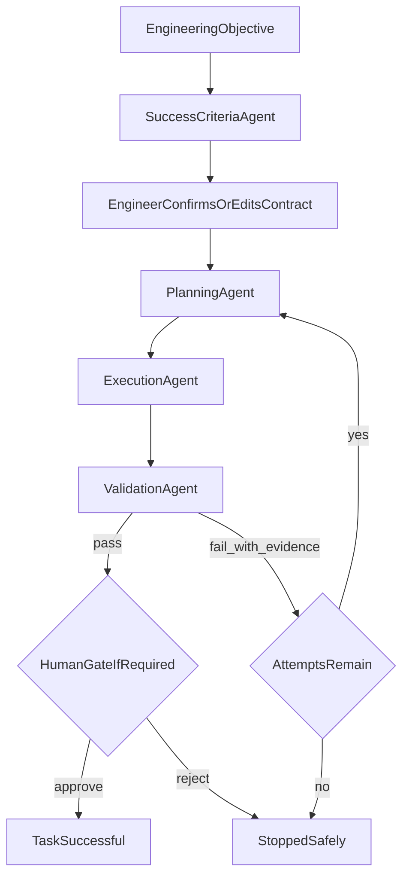

# Problem Statement 1 — Track B (Careful Read)

**Source:** [The Talent Hack (Build Sprint) _ Problem Statements.docxfb34026.pdf](The%20Talent%20Hack%20(Build%20Sprint)%20_%20Problem%20Statements.docxfb34026.pdf)

**Title:** Loop Engineering Platform — A Control Plane for AI Coding Work

**One-line intent:** Build a credible **control plane** for long-running AI coding work (define, configure, run, inspect) — **not** another chat UI.

---

## Shared core (applies to Track B too)

Both tracks share one autonomous loop. Track B must still demonstrably:

1. **Plan like a senior engineer** — grounded plan naming real files/modules/patterns/order/risks
2. **Separate generation from acceptance** — LLMs generate; only deterministic checks accept; same state → same verdict every time
3. **Feed failure back** — actionable feedback → next attempt; bump iteration count
4. **Stay bounded** — retry budget; on exhaustion: rollback, green workspace, honest “undelivered”
5. **Ask instead of guess** — ambiguous/contradictory reqs → halt + structured clarification
6. **Keep receipts** — inspectable trail (who/what/files/commands/verdicts/retries/cost)
7. **Integrate a real agent runner** — harness/SDK with FS + shell + tests/builds + transcript capture; model/provider/backend configurable

Validation may mix deterministic checks, optional LLM-as-judge (rubric + evidence), and human review for high-risk changes.

---

## What Track B is

A platform where an engineer can **define, configure, execute, and inspect** an AI-assisted coding workflow for a non-trivial task.

### Default four-agent loop (template, not hardcoded)

| Role | Job |
|------|-----|
| **Success Criteria Agent** | Objective → measurable completion criteria |
| **Planning Agent** | Create/revise implementation plan |
| **Execution Agent** | Make codebase changes |
| **Validation Agent** | Complete? + evidence when not |

### Default flow

Must be a **configurable template**: users can adjust agent instructions, models/providers, tools per agent, success criteria, validation checks, max iterations, failure paths, human approval points, completion conditions.

### Real demo task required

Run **one real coding task** against a repository that needs plan → implement → validate → iterate (multi-file feature, hard bugfix, refactor, migration, dep replace, tests, sync→async, perf target, security/static findings). Challenging but demoable in-event.

### Primary user

Engineer/tech lead who has a repo, knows the outcome, may not know every step, wants iterative agents + evidence of completion, and must inspect / stop / edit / approve.

---

## Success criteria (hybrid default)

Three modes:

- **User-defined** — engineer writes criteria
- **Agent-generated** — agent proposes
- **Hybrid (default)** — engineer gives objective + constraints; agent proposes measurable criteria for approval

Before run: review, edit, prioritize, confirm (including human approvals).

Example criteria: build OK, existing tests pass, new tests added, required file/feature exists, protected files untouched, coverage threshold, perf vs baseline, API compatibility, architecture adherence.

---

## Visual node canvas (core UX)

Inspired by **Rivet** — graph editor, **not** wizard/dashboard of forms.

User can: add nodes from library, connect for order, select + edit settings, configure success/failure paths, run full graph, see per-node status/output.

### Minimum node library

- **Input** — coding objective + constraints
- **Agent** — criteria / planning / implementation
- **Command** — build/test/repo command
- **Validator** — criteria satisfied?
- **Decision** — branch on result
- **Human Gate** — pause for approval/feedback
- **Success / Stop** — complete or safe terminate

### Main screen = five areas

1. **Top bar** — workflow name; save/export; run/pause/stop; run status; attempt counter
2. **Node library panel**
3. **Graph canvas** — each node: name, type, status, config summary, ports, latest result during run
4. **Node inspector** — only settings relevant to selected node (name, instructions, model, tools, command, validation criteria, retry limit, timeout, success/failure paths)
5. **Collapsible run console** — agent messages, commands, files changed, validation evidence, errors, retry reasons, human feedback; click completed/failed node → inspect that execution

Out of scope for MVP: nested graphs, auto-layout, collaboration, huge node catalogs.

---

## Session inspection + config-as-code

**Inspect at minimum:** agent input/output, commands/tools, files created/changed, validation results, retry reason, current status. Live token streaming optional.

**Export** workflow as YAML/JSON: agents, instructions, tools, task contract, validation checks, retry limits, transitions, approvals. Import + rerun desirable.

---

## Required demonstration (9 beats, ~5–7 min)

1. Enter coding objective  
2. Generate or edit success criteria  
3. Configure four-agent loop  
4. Save or export workflow  
5. Run against a repository  
6. Show real validation result + evidence  
7. Failed attempt → feedback into next iteration  
8. Later success **or** safe stop after budget exhausted  
9. Inspect agent sessions + file changes  

A deliberate first failure is OK to show the loop.

---

## Bonus (Track B)

- Token / model-call / cost tracking  
- Live agent or command streaming  
- Git worktrees / containers / isolated attempts  
- Pause, resume, checkpoint recovery  
- Reusable versioned templates  
- External coding harness / multi-provider integration  

---

## Desired outcome (both tracks)

Bounded, measurable, repeatable autonomy: outcomes over micromanaged prompts; configurable roles; validation drives iteration; inspectable evidence; same loop can be rerun.

---

## Explicit non-goals for Track B (vs Track A)

Track B is **not** the Twenty CRM Feature Factory (brownfield seed data, FEAT-101–105 lead scoring, hidden acceptance suite against a deployed Twenty). Track B’s product is the **loop control plane + visual workflow + real demo task on some repo**.

---

## Repo note

Workspace currently has only this PDF + a minimal README — no existing FlowForge app code yet.
